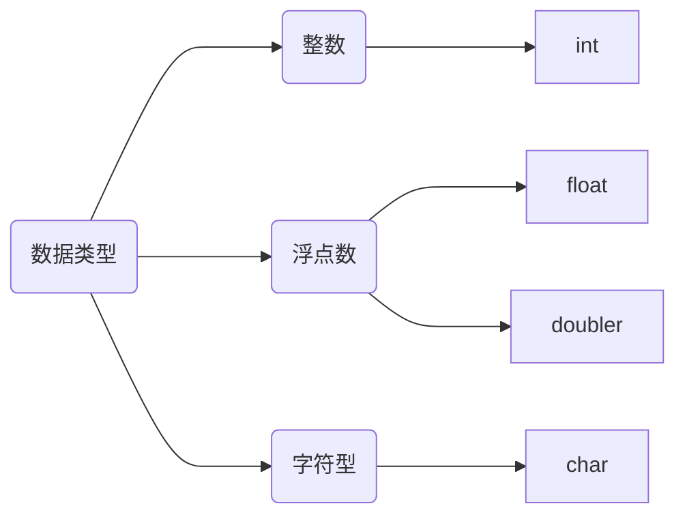
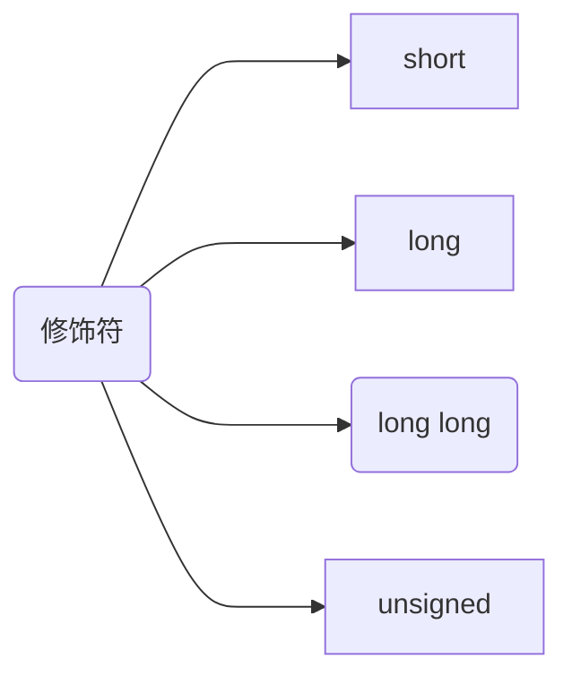
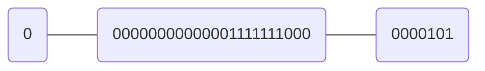

# 3 数据和C

-----

这里需要先掰扯清楚一件事情：计算机是怎么存储**整数**和**浮点数**的。

整数很简单，就是转换为二进制存就可以了，这里需要提的一个概念就是补码。

### 补码

[参考博客](https://blog.csdn.net/zhuozuozhi/article/details/80896838)

补码生成就是符号位不变，其余位取反。

再来就是是否补码跟原码的加减乘除都一致。直接看一个例子：
$$
这里拿9和-1举例子，模为11。\\
\begin{cases}
(9+(-1))\mod 11=8=(9+(11-1))\mod 11 & 加法\\
(9-(-1))\mod 11=10=(9-(11-1))\mod 11 & 减法(-1会被转换为其补码，即11-1=10)\\
\end{cases}
$$
要开始说乘除法之前，需要先说明计算机如何处理乘除法。

[参考博客](https://www.cnblogs.com/stigerzergold/p/10328472.html)

先来说乘法，就是一个与门，再来一个加法器，最后配上一个存储中间数据的寄存器，就可以搞定了。

再来就是除法，一个比较器，一个减法（我们可以换成上面的加法），还有一个存储中间数据的寄存器，也可以搞定。

所以，综上所述，使用补码来进行计算，是和原本的计算结果是一致的，所以我们可以将负数保存成补码的形式来进行计算。

## IEEE-754

[参考视频](https://www.bilibili.com/video/BV1AE41137TM?from=search&seid=15470314657378542777)

这个主要是为了解决如何存储小数，看下面这个例子：
$$
比如：31.24\\
首先将31和24分别转换为二进制小数：\\
11111.11000，然后将小数点左移动下面的形式：0.1111111000 * 2^5，之所需要 * 2^5，因为左移了，所以需要补上变小的值。\\
这个时候需要存储的值就3部分：\\
符号位：1表示负数，0表示正数。\\
小数位：.1111111000 这部分，去掉.之后直接存储就可以了，反正都是二进制数。\\
指数位：5
$$
这里需要看具体存储指数位的位数有多少位，我们才可以确定补码值为多少。这里假设符号位为1位，小数位为23位，指数位为8位，所以最终结果为：

这样我们就可以首先根据指数位获取小数点位置，在确定小数点前的值和小数点后的值，再配合符号位，就可以获取是正数还是负数了。就是上面操作的逆操作。

然后我们上面定义的这种存储规则，就叫做`IEEE-754`，其实就是采用32位来存储浮点数，也叫做单精度浮点数。

同样，也可以采用64位来存储数据，这个时候，同样，符号位为1位，指数位为11位，小数位为52位。这种方式就是双精度浮点。

------

在上面的例子中，指数位恰好是正数，如果是负数呢？就会变成补码的形式来存储，那么到时候要如何恢复呢？这里需要扯回补码的表示形式，第一位是符号位，不动的，所以之前是负号的就还是负号，只是从5存储成了`2^7-1-5`或者`2&10-1-5`的二进制形式而已，所以只需要再执行一次mod操作，再配合上符号位，就可以恢复到原本的值了。

-------

## 字，字节，位

扯到这里是因为上面出现了两个经常听到的数字：32和64，我们知道电脑有32位的和64位的，啥意思呢？

首先说位，这个很好理解，就是0和1两种结果的单位。

字节，固定值，8位为一个字节。

字，就有32位字节为1个字长的，也有64位为1个字长的区别了，所以就有了32位和64位的这种区分。

-------

## int型

先说默认的int是有符号位的，所以需要1位来存储符号，如果是32位的计算机，1位存储符号，31位存储数字，即能存储的数据范围为：
$$
最小值为：100 \cdots 00，即 -({2}^{31}) \\
最大值为：011 \cdots 11，即 ({2}^{30})-1 
$$
这里的符号位，1代表负数，0代表正数。如果你想将符号位也拿来存储数据，可以使用`unsigned`修饰符。

如果存储的值不需要那么大，可以使用`short`修饰符，同样，如果需要存储的值比int大，那么可以考虑加上修饰符：long，或者long long。同样，如果想将符号位拿来存储数据，可以使用`unsigned`。

### inttypes.h

这个里面定义了很多更加细分的int型数据，比如：

- int32_t
- int_least8_t
- int8_t
- int_fast8_t

等。

## char

说到这个就要扯到编码了，啥是编码呢？简单来说就是替换表，将我们的源内容替换成二进制数，方便计算机存储和处理，毕竟世界上那么多语言和符号，而计算机只认识0和1，所以肯定需要替换表来标明替换的关系。比如汉字最常见的就是GBK编码，或者现在最受欢迎的UTF-8编码。

## _Bool

这玩意本质上是int，只是比int需要的存储空间更小，只有1位，1表示true，0表示false。

