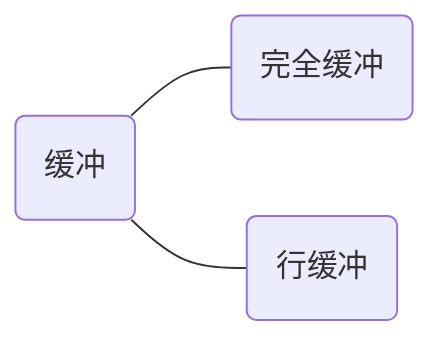
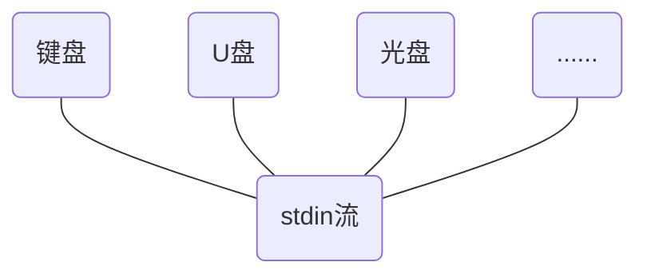

# 缓存区

缓冲区即输入到输出之间，输入会被暂存在这里，直到满足一定条件，输出内容才从缓冲区到输出。

具体的条件即为下面两种：



- 完全缓冲：直到缓冲区被占满，才进行输出操作
- 行缓冲：遇到换行符时，才进行输出。

比如下面这段代码：

```c
#include "stdio.h"

int main() {
    char inputChar;
    while ((inputChar=getchar())!='#')
        putchar(inputChar);
    return 0;
}
```

在这里虽然我们使用了读取单个字符的输入函数：`getchar()`，但是我们可以直接输入多个值，只有敲回车后才会显示：


这里就是行缓冲的效果了。

--------

# 文件结尾

## 流 / stream

计算机底层不同的I/O函数，导致了I/O操作的种类很多，而如果我们将这些区分都在标准I/O库层面进行屏蔽，提供给开发人员统一的操作对象，是不是会方便很多，所以，这里对于开发人员来说，之前是操作文件，实际上就是操作**流**。

-----------

- 字符串的结尾：\0

- 行的结尾：\n
- 文件的结尾：EOF

这里的EOF是啥呢？就是在`stdio.h`中定义的预变量，标志着一个文件的结尾。其具体的值由系统决定，即不同的系统定义不同。

```c
#include "stdio.h"

int main() {
    int intput;
    while ((intput=getchar())!=EOF)
        putchar(intput);
    return 0;
}
```

这里因为我是mac的环境，我也不知道怎么输入文件的结尾符号，书上说的`ctrl+d`和`ctrl+z`都不行。

# 重定向



stdin代表的是标准输入，即对于stdin来说，输入设备它并不关系，反正对于它来说就是标准输入流。

比如上面的输入代码：


这样就演示了一下如何做重定向输入。

至于输出部分，还是前面缓冲区的内容，行缓冲，遇到换行符就会输出。

重定向输出用的就比较多了，最简单的一个shell命令就可以演示：


