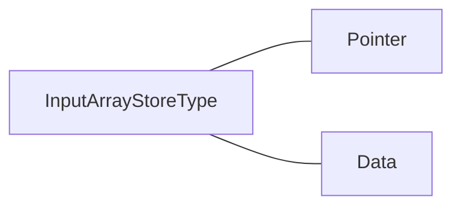

# C语言中的二维数组与指针

这一块是很烦，但是理顺了之后就会简单很多。

## 数组存储本质

首先看下面一段代码：

```c
int singleArray[4]={1,2,3,4};
```


其在内存中的就是这样的存储形式，其中`地址1`代表的就是`singleArray`，其本质就是一个指针值，所以你采用`*singleArray`就能获得`1`。

或者你还有可能见到这种写法`*(singleArray+1)`，这样就能获得数组第二个的值，即`2`，这是因为地址2和地址3的值是连续的，两者之间的差值是1，为什么是1呢？这个需要结合数电的知识解释，这里你只需要知道，这里的本质是将其地址的值增加后获取新的地址的值即可。

## 数组与函数

下面就要结合函数来理解了，试问下面这两个函数有什么区别：

```c
void inputPointer(int *array){
    //
}

void inputArray(int array[]){
    // 
}
```

答案：没有区别，都是告诉**编译器**，我会在这里传入一个数组，数组中的都是具体的值。

-------

## 多维数组与指针：数组值为指针类型

再看下面两个函数，有什么区别：

```c
// 这个上面见过
void inputPointer(int *array){
    //
}
// 重点是这个
void inputMultipleArray(int* *array){
  	//
}
```

看下面第二个函数，这里是在告诉**编译器**，我会在这个函数中传入一个数组，数组中的值为指针，这里有个有意思的点，什么叫数组中的值为指针呢？看下面这个例子：

```c
int index1Array[]={1,2};
int index2Array[]={3,4};
int index3Array[]={5,6};
int* result[3];
result[0]=index1Array;
result[1]=index2Array;
result[2]=index3Array;
```

其中，这里的`result[0]=index1Array;`，根据前面的讲解，`index1Array`即代表的是数组的首地址，即指针的数据类型，而`int* result[3]`则是告诉**编译器**，我要申请3块连续的内存空间（数组的特性），用来存储`int`型的数组的地址，如果用具体的图表来表示就是：


其中`result`即代表`地址1`。

## 多维数组与指针：值为具体的值

上面是定义一个1维数组，然后在其中存储其他数组的地址以此来实现多维数组的形式，那么下面这种形式的多维数组，**编译器**是如何处理的呢？

```c
int multipleArray[3][2]={
            {1,2},
            {3,4},
            {5,6}
    };
```

这个本质上还是一维数组，具体的存储形式如下：


其中`multipleArray`即代表`地址1`。那么有个问题，既然是存储成一维数组的形式，那么当我输入`multiple[1][2]`的时候，**编译器**怎么知道去找哪里的值呢？

在解决这个问题之前，设想一下下面的数学关系：


这里假设数组大小为`[I][J]`，那么数组下标和内存块下标的换算关系是不是就是：
$$
i \cdot J +j+1
$$
在上面的例子中`[I][J]`即为`[3][2]`。这里你可以试着将具体的值带进上面的公式中试一下。

所以其中很重要的一个值就是`J`的值，即多维数组中每个一维数组的长度，只有这样，**编译器**才能实现数组下标到内存块之间的换算。

所以，真对上面这种其中为具体的值的多维数组，在传入函数时，采用下面的形式：

```c
void inputMultipleArray(int (*multipleArray)[3]){
    //
}
```

这里借用了`[3]`就是在告诉**编译器**`J`的值。

这里有个很有意思的情况，上面我们定义`multipleArray`的时候，是`[3][2]`的数组，在这里却将其修改为单个数组长度为3的多维数组，会发生什么情况呢？

很简单，就是会变成下面的形式：


简单来说就是从`[3][2]`数组变成了`[2][3]`的数组了。

## 函数中传入参数的具体使用

到这里为止，说完了多维数组在C的编译器下的具体存储情况，但是还差一部分，即当函数传入不同的值时，在函数内部如何取值：



先说传入的多维数组中存储的值为指针类型的写法：

```c
#include "stdio.h"

void inputMultiplePointerArray(int* *array,short int lineNumber,short int columnNumber){
    printf("(%d,%d) is %d\n",lineNumber,columnNumber,array[lineNumber][columnNumber]);
}

int main() {
    int index1Array[]={1,2};
    int index2Array[]={3,4};
    int index3Array[]={5,6};
    int* result[3];
    result[0]=index1Array;
    result[1]=index2Array;
    result[2]=index3Array;
    inputMultiplePointerArray(result,0,1);
    return 0;
}
```

这是一个例子，但是如果还是上面的情况，我写成下面的形式时，会是什么情况呢？

```c
void inputMultiplePointerArray(int* (*array)[3],short int lineNumber,short int columnNumber){
    
}
```

这里我告诉**编译器**，我将传入一个指针类型的参数：`*array`，其中存储的值为int型的指针地址：`int*`，并将其强制修改为单个长度为3的多维数组：`[3]`，这里的问题是，如何取值呢？能像上面那样直接写成：

```c
void inputMultiplePointerArray(int* (*array)[3],short int lineNumber,short int columnNumber){
    printf("(%d,%d) is %d\n",lineNumber,columnNumber,array[lineNumber][columnNumber]);
}
```

即`array[1][2]`这样的形式吗？答案是不行！必须写成：

```c
void inputMultiplePointerArray(int* (*array)[3],short int lineNumber,short int columnNumber){
    printf("(%d,%d) is %d\n",lineNumber,columnNumber,&(array[lineNumber])[columnNumber]);
}
```

这是为什么呢？这个解释起来就很有意思了，回到最开始我们提出`(*array)[3]`时，我们提出这种情况下，**编译器**默认你当前采用的存储结构为如下形式：


即连续的内存存储，所以可以根据首地址和数组下标获取到最终的地址值，即在取`a[1][2]`时，（假设`J`的值为3）首先根据`a[1]`获取到地址4的值，再来根据`[2]`获取到地址6的值，这样没有问题。

但是你现在告诉编译器，我这里存储的值是指针，即`a[1]`的地址不再能帮助我们获取到`a[1][2]`的值，因为指针的内存空间不是连续的，再采用上面的方式将`a[1]`所代表的内存块往后计算2块内存块的地址，很大可能上不是我们所需要的值，所以我们需要告诉**编译器**，在获取`a[1]`时，不要采用`a[1]`的地址，而要采用它当中的**值**，在该值所代表的内存块上再计算2个内存块的地址，才是我们想要的值。

---------

上面讲完了其中存储的值是指针的情况，其中的值是具体的值的情况就简单很多了：

```c
#include "stdio.h"

void printArray(int (*multiple)[2],short int firstColumn,short int secondColumn){
    printf("(%d,%d) is %d\n",firstColumn,secondColumn,multiple[firstColumn][secondColumn]);
}

int main() {
    int multipleArray[3][2]={
            {1,2},
            {3,4},
            {5,6}
    };
    printArray(multipleArray,1,2);
}
```

## 总结

上面我一直在说**编译器**如何如何处理，实际上是因为写法肯定是讲不完的，重要的就是需要结合具体的代码去分析，在当前情况下，到底在处理的是什么值，否则如果一直在纠结语法的变化形式上，就会陷入死循环的。