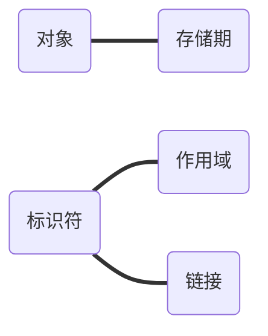
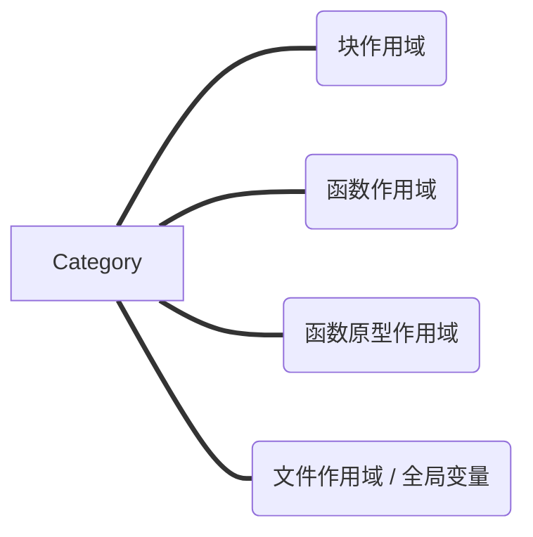
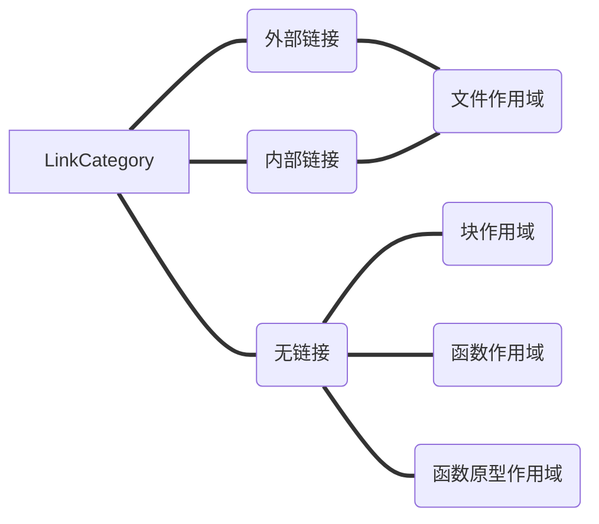

# C语言存储类别、链接和内存管理

## 基础概念

首先就是介绍一些基本概念，然后就是分别扩展这些概念的属性：

- 对象：**内存**中一个存储单位存储的具体的值
- 标识符 / 左值：就是代码中代表内存中对象的值，比如：

```c
int sign=1;
```

中的`sign`就是一个标识符，`sign+1`就不是一个标识符，因为它不代表内存中的任何一个值。

但是结合到指针就会再复杂一点：

```c
char address[]="hello world";
```

这里`*(address+1)`也可以算是一个标识符，因为其也代表一个内存地址。

标识符有一个特性就是是否可修改。

在[C语言中的二维数组与指针](https://blog.csdn.net/YQXLLWY/article/details/115417107)说：

```c
const char* unchangeAbleString="hello world";
```

和

```c
char* unchangeAbleString="hello world";
```

的效果是一样的，这里在是否可修改的角度上来说明一下：


这里的`const`是保证`"hello world"`的这块字符串是不可修改的，`*unchangeableString`还是可以指向其他地址的，比如下面的代码就是错误的：

```c
#include "stdio.h"

int main(int argc,char* argv[]) {
    char* unchangeableString="hello world";
    unchangeableString[0]='q';
    printf("%s",unchangeableString);
}
```

因为这里我们尝试使用`unchangeableString[0]`去修改`const`设定的值，肯定是改不动的。

但是上面我们提到，让`unchangeableString`去指向新的地址，却是没有问题的，比如下面的代码：

```c
#include "stdio.h"

int main(int argc,char* argv[]) {
    char* unchangeableString="hello world";
    char* newString="hello c";
    unchangeableString=newString;
    printf("%s",unchangeableString);
}
```

这样就介绍了基本概念，接下来就是这些基础概念与之对应的属性：



## 作用域

作用域共分为：



### 块作用域

这个很简单，被套在`{}`之间的作用域，这个有个很有意思的对比，下面相同类型的代码，首先在PHP中：

```php
<?php
function param(){
	while (true) {
		$data=1;
		break;
	}
  // 这里是可以访问上面{}中的内容的
	print $data.PHP_EOL;
}
param();
?>
```

中，在`{}`外部是可以访问在其中定义的内容的，但是在C语言中：

```c
#include "stdio.h"

int main(int argc,char* argv[]) {
    while (1){
        short int data=1;
        break;
    }
    // 这里会报错，表明没有这个值
    printf("%d",data);
}
```

这里有一些特殊的情况，就是类似下面这种：

```c
for (int i = 0; i < 10; ++i) {
        printf("%d\n",i);
    }
```

这种，`int i`是在`{}`外部定义的，也可以使用。

### 函数作用域

这个值很有意思，和`goto`有关，看下面的代码：

```c
#include "stdio.h"

int main(int argc,char* argv[]) {
    getIdo:printf("You get ido number\n");
    // 这是个死循环
    int i=0;
    while (i<3){
        i++;
        if (i%2==0){
            goto getIdo;
        }
    }
}
```

在`goto`之间的参数`int i=0`会一直有效，所以是个死循环。修改成下面的就可以了：

```c
#include "stdio.h"

int main(int argc,char* argv[]) {
  	// 将这个值移动出来
    int i=0;
    getIdo:printf("You get ido number\n");
    while (i<3){
        i++;
        if (i%2==0){
            goto getIdo;
        }
    }
}
```

### 函数原型作用域

这个就很简单了，就是说函数的参数，仅仅在该函数内部有效，比如：

```c
#include "stdio.h"

int functionPrototype(int n1,int m1,int a[n1][m1]);

int main(int argc,char* argv[]) {
    int n,m;
    n=1;
    m=1;
    int a[1][1]= {
            {1}
    };
    functionPrototype(n,m,a);
}
// 这里的 n,m,a 跟外部都没有关系
int functionPrototype(int n,int m,int a[n][m]){
    return 0;
}
```

### 文件作用域 / 全局变量

这个很简单，就是定义在**函数外部**的变量：

```c
#include "stdio.h"

float PI=3.1415926;

void printPI();

int main(int argc,char* argv[]) {
    printf("PI is %f\n",PI);
    printPI();
}

void printPI(){
    printf("PI is %f\n",PI);
}
```

因为在任何地方都可以访问到这个值，所以也称为**全局变量**。

## 链接

这个需要和上面的作用域关联起来看：



### 无链接

简单来说就是：

- 块作用域
- 函数作用域
- 函数原型作用域

中的标识符都是没有链接的，仅在这些作用域内部使用。

### 外部链接 / 内部链接

这两个为什么要连在一起说呢？

在开始介绍前，先介绍一个名词：**翻译单元**，当前文件和其所包含的头文件组成。

这里举个例子：

比如这里我在同一个目录下首先定义一个文件：`file1.c`：

```c
#include <stdio.h>

void fun(void)
{
    printf("hello from fun.\n");
}
```

再定一个文件：`file2.c`：

```c
int main(void)
{
    fun();
    return 0;
}
```

注意！这里调用了一个在`file1.c`中定义的函数：`fun()`。然后调用gcc进行编译：

```bash
gcc file1.c file2.c
```

这样的方式就定义了一个翻译单元。

------------------

再来就是介绍内部链接：内部链接仅在一个翻译单元中使用，使用关键字：`static`标明。

这里扩充一下`static`的作用，可以更好的理解上面说的作用域。[参考博客](https://blog.csdn.net/guotianqing/article/details/79828100)

这里先修改`file1.c`：

```c
#include <stdio.h>
// 注意这里的变量，会在 fil2.c 中也定义一个
static int staticInt=1;

void fun(void)
{
    printf("hello from fun.\n");
}

static void privateFunction(){
    printf("%d\n",staticInt);
}
```

再修改`file2.c`：

```c
#include "stdio.h"
// 这里的值在 file1.c 中也有，但是因为在 file2.c 中使用 static 定义为内部链接，所以不会跟这里起冲突
int staticInt=2;

int main(void)
{
    fun();
    printf("%d",staticInt);
    return 0;
}
```

同样，`static void privateFunction()`在`file2.c`中也不能调用。


