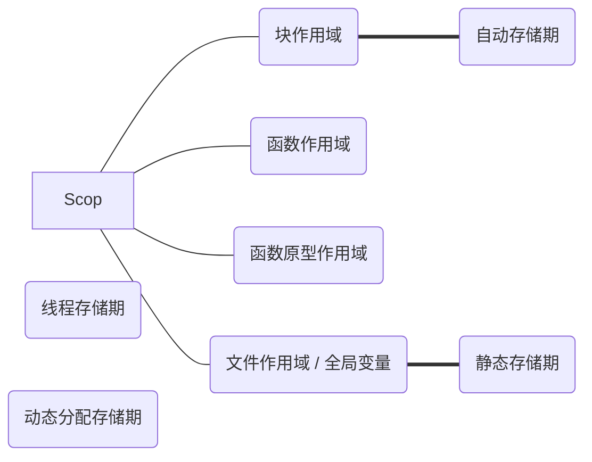

# C语言存储类别、链接和内存管理

[基础概念，作用域和链接](https://blog.csdn.net/YQXLLWY/article/details/115560612)

## 存储期

啥叫存储期呢？简单来说就是当前变量什么时候被自动销毁，内存被回收。

比如：

```c
#include "stdio.h"

void debug(void );

int main(int argc,char* argv[]) {
    // 调用 debug()函数，其中的变量 int data=1;被分配内存
    debug();
    // 调用结束，debug() 中的 int data=1; 被自动销毁
    // 再次被调用，则再次被创建
    debug();
    return 0;
}

void debug(void ){
    int data=1;
}
```

结合作用域的种类来说明各个作用域的变量的所具有的存储期为：



### 静态存储期

这个主要就是在文件作用域下的变量，在执行到任何一个文件中的代码时，都是生效的。

这里有一个综合**链接**的说法：不论一个变量是内部链接还是外部链接，都具有静态存储期。当然啊，毕竟文件作用域具有内部链接和外部链接两种种类嘛。这里分别举个例子：

```c
#include "stdio.h"

int data=1;
static int data2=1;

void debug(void );

int main(int argc,char* argv[]) {
    debug();
    debug();
    return 0;
}

void debug(void ){
    // 因为是静态存储期，所以在第二次调用的时候不会再重新赋值，另外这里是块作用域
    static int data3=1;
    // 因为是静态存储期和文件作用域，所以在进程结束之前，这个变量对于全局都是有效的
    data++;
    printf("%d\n",data);
    // 只是说明内部链接也是一样的效果
    data2++;
    printf("%d\n",data2);
    data3++;
    printf("%d\n",data3);
}
```

### 自动存储期

在最开始举的例子就是，简单来说就是由操作系统自动控制内部的分配和释放。

### 线程存储期

顾名思义，假设当前变量是在一个线程中被创建的，那么在这个线程执行结束之后，自然会被销毁。

### 动态分配存储期

这个书上没有讲，暂时不知道。

## 存储类别

在介绍这个之前，先说前面的内容都说话啥：

- 作用域：变量在以特定的方式被创建之后，能在哪些地方被使用
- 链接：介绍链接的概念
- 存储期：变量的存活时间，即在什么时候这个变量被销毁，所占用的内存被释放
- 存储类别：综合上面的因素后对变量的种类进行分类。

下面就是介绍5种存储类别。

### 自动变量：块作用域，无链接，自动存储期

这个很简单，就是前面的自动存储期类似。这个有意思的是块作用域下的同名变量的特性：

```c
#include "stdio.h"

int main(int argc,char* argv[]) {
    // 这里的n是一个变量
    int n=1;
    printf("n is %d\n",n);
    // 这里的 n 是另一个变量
    for (int n = 0; n < 10; ++n) {
        printf("loop n is %d\n",n);
    }
    // 这里又恢复到最开始的那个 n
    printf("after n is %d\n",n);
    n++;
    if(1){
        // 这里又是一个新的 n
        int n=1;
        printf("inside if n is %d\n",n);
    }
    n++;
    // 这里又恢复到最开始的那个n
    printf("after n is %d\n",n);
}
```

### 寄存器变量：块作用域，无链接，自动存储期

[寄存器，内存，CPU之间的关系](https://blog.csdn.net/huangchunxia_1/article/details/79203056)

这种变量是存储在寄存器中的，访问速度最快，但是因为不在内存中，所以没有地址，并且因为寄存器大小的问题，所以存储的数据也不能很大。

并且即使在代码中说要将这个变量存储在寄存器中，但是也不一定能申请到寄存器，如果申请不到，就是普通的自动变量了。

申明寄存器变量采用关键字：`register`：

```c
#include "stdio.h"

int main(int argc,char* argv[]) {
    register int i=1;
    printf("%d\n",i);
}
```

### 静态变量：文件作用域，内部链接和外部链接，静态存储期 / 块作用域，无链接，静态存储期

这里分别来说明，首先是文件作用域，内部链接和外部链接，静态存储期。

这里拿两个文件来举例子：`file1.c`：

```c
#include <stdio.h>
// 文件作用域，内部链接，静态存储期
static int staticInt=1;

void fun(void)
{
    printf("hello from fun.\n");
}

static void privateFunction(){
    printf("%d\n",staticInt);
}
```

定义另一个文件：`file2.c`：

```c
#include "stdio.h"
// 文件作用域，外部链接
int staticInt=2;
// 这里使用关键字：extern，标明使用外部链接
// 这个可以不申明，编译器到时候会去被编译的文件中寻找
extern void fun(void );

int main(void)
{
    fun();
    // 看，这里即使不使用 extern int staticInt;也可以使用这个值
    printf("%d",staticInt);
    return 0;
}
```

然后使用`gcc file1.c file2.c`来编译这两个文件。

块作用域，无链接，静态存储期：

```c
#include "stdio.h"

int debug(void );

int main(int argc,char* argv[]) {
    for (int i = 0; i < 10; ++i) {
        printf("%d\n",debug());
    }
    return 1;
}

int debug(void){
    // 块作用域，无链接，静态存储期
    static int i=1;
    i++;
    return i;
}
```

